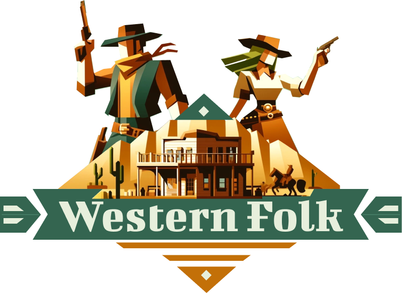
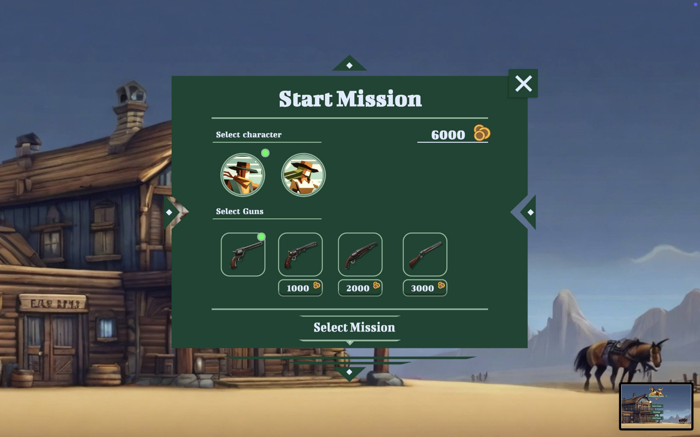
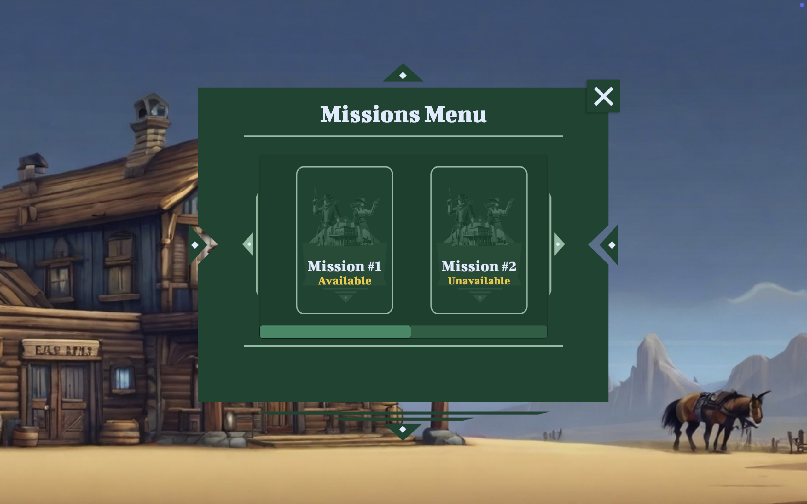
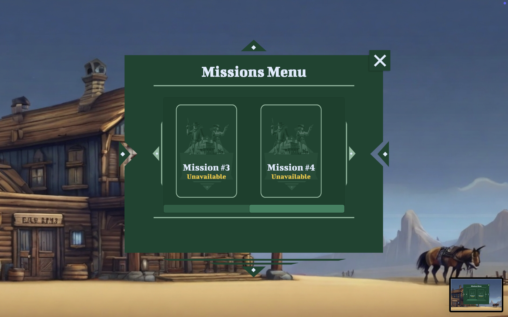
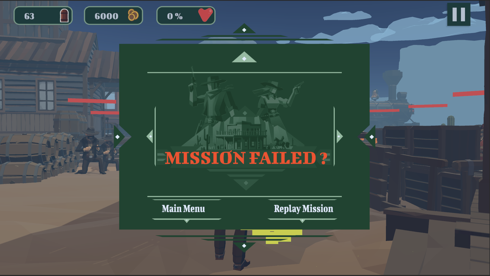
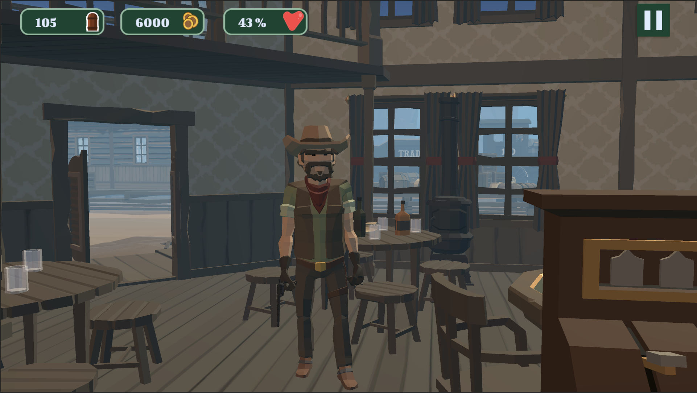
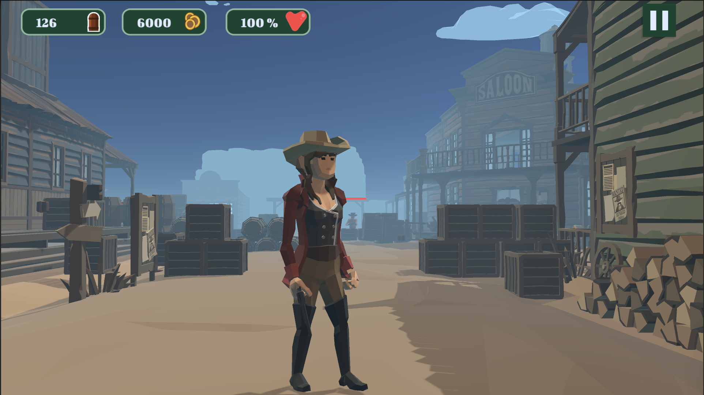
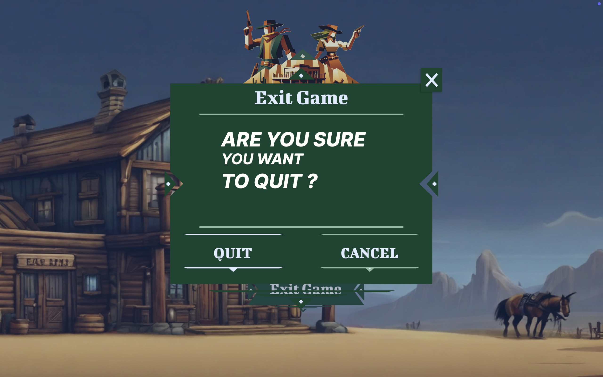

<p align="center">
  
</p>

# Western Folk

A 3D action-adventure prototype set in a stylized Western world. Choose **cowboy or cowgirl**, pick a mission, and clear out rattlesnakes, scorpions, and bandits with tight FPS-style combat and exploration. Built in **Unity** with low-poly POLYGON Western assets.

## 🎥 Demos
<p align="center">
  <a href="https://youtube.com/watch?v=w64vDeA4ToM">
    
  </a>
</p>

<p align="center">
  <a href="https://youtube.com/watch?v=VPoyGa4p2Z0">
    
  </a>
</p>

<p align="center">
  <a href="https://youtube.com/watch?v=e93H2yKdAvE">
    
  </a>
</p>

<p align="center">
  <a href="https://youtube.com/watch?v=PofJVJNDFYY">
    
  </a>
</p>

## 📸 Screenshots
<p align="center">
  
</p>
<p align="center">
  
</p>
<p align="center">
  
</p>
<p align="center">
  
</p>
<p align="center">
  
</p>
<p align="center">
  
</p>
<p align="center">
  
</p>
<p align="center">
  
</p>

## ✨ Features
- **Playable heroes:** Pick **cowboy** or **cowgirl**  
- **Four-mission arc:** Train wreck (snakes & scorpions), town (bandits), saloon (bandits), plus a WIP fourth mission  
- **Health & UI:** Enemy health bars; player health percentage shown in HUD  
- **Combat loop:** Ammo counts, reloading, and ammo drops from barrels; aid kits from breakable boxes  
- **Economy:** Collect **gold coins** to buy weapons; choose weapon pre-mission  
- **Menus & settings:** Main menu, mission select, music/SFX toggles  
- **Progression:** Defeat all enemies to finish; unlocks the next mission on success

## How to Play
1. Choose your character and weapon, then select a mission  
2. Move, aim, and shoot to clear all enemies. Pick up ammo and aid kits from environmental props  
3. If your health hits **0**, it’s game over; beat all enemies to advance

## 📦 Tech Stack
- **Engine:** Unity (desktop dev, targeting mobile later)  
- **Art:** Synty Studios – POLYGON Western Pack (low-poly), Figma
- **Audio:** Royalty-free Western BGM + SFX (gunfire, reload, UI)  

## 🛠 Requirements
- Unity 2023.1.15f1

## 🚀 Getting Started (Dev)
```bash
# Clone
git clone https://github.com/liscontoli/WesternFolk.git
cd WesternFolk

# Open in Unity
# Unity Hub → Add → select this folder → Open
