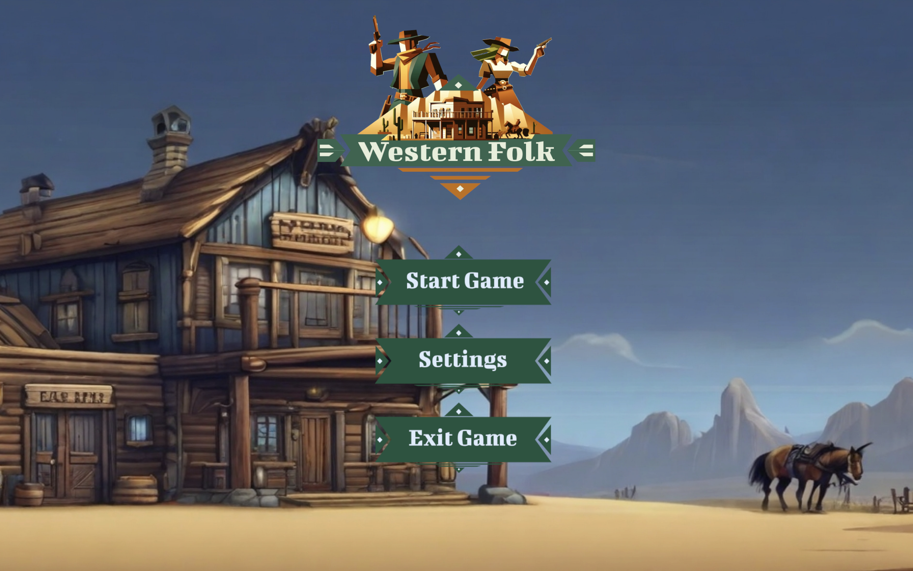

# Western Folk

A 3D action-adventure prototype set in a stylized Western world. Choose **cowboy or cowgirl**, pick a mission, and clear out rattlesnakes, scorpions, and bandits with tight FPS-style combat and exploration. Built in **Unity** with low-poly POLYGON Western assets. :contentReference[oaicite:0]{index=0}

## 🎥 Demos
[](https://youtube.com/watch?v=w64vDeA4ToM)

[](https://youtube.com/watch?v=VPoyGa4p2Z0)

[](https://youtube.com/watch?v=e93H2yKdAvE)


[](https://youtube.com/watch?v=PofJVJNDFYY)


## 📸 Screenshots



## ✨ Features
- **Playable heroes:** Pick **cowboy** or **cowgirl**. :contentReference[oaicite:1]{index=1}  
- **Four-mission arc:** Train wreck (snakes & scorpions), town (bandits), saloon (bandits), plus a WIP fourth mission. :contentReference[oaicite:2]{index=2}  
- **Health & UI:** Enemy health bars; player health percentage shown in HUD. :contentReference[oaicite:3]{index=3}  
- **Combat loop:** Ammo counts, reloading, and ammo drops from barrels; aid kits from breakable boxes. :contentReference[oaicite:4]{index=4}  
- **Economy:** Collect **gold coins** to buy weapons; choose weapon pre-mission. :contentReference[oaicite:5]{index=5}  
- **Menus & settings:** Main menu, mission select, music/SFX toggles. :contentReference[oaicite:6]{index=6}  
- **Progression:** Defeat all enemies to finish; unlocks the next mission on success. :contentReference[oaicite:7]{index=7}

## How to Play
1. Choose your character and weapon, then select a mission. :contentReference[oaicite:8]{index=8}  
2. Move, aim, and shoot to clear all enemies. Pick up ammo and aid kits from environmental props. :contentReference[oaicite:9]{index=9}  
3. If your health hits **0**, it’s game over; beat all enemies to advance. :contentReference[oaicite:10]{index=10}

## Tech Stack
- **Engine:** Unity (desktop dev, targeting mobile later)  
- **Art:** Synty Studios – POLYGON Western Pack (low-poly), Figma
- **Audio:** Royalty-free Western BGM + SFX (gunfire, reload, UI)  

## Requirements
- Unity 2023.1.15f1

## 🚀 Getting Started (Dev)
```bash
# Clone
git clone https://github.com/liscontoli/WesternFolk.git
cd WesternFolk

# Open in Unity
# Unity Hub → Add → select this folder → Open
